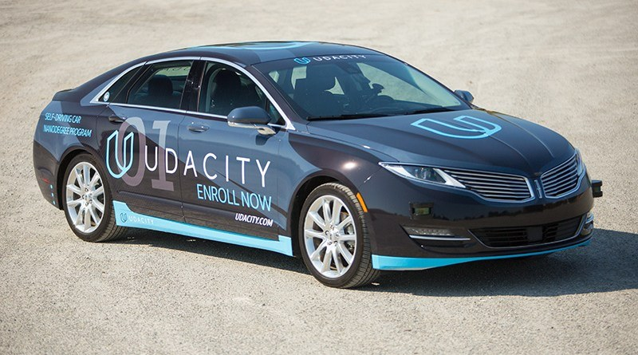
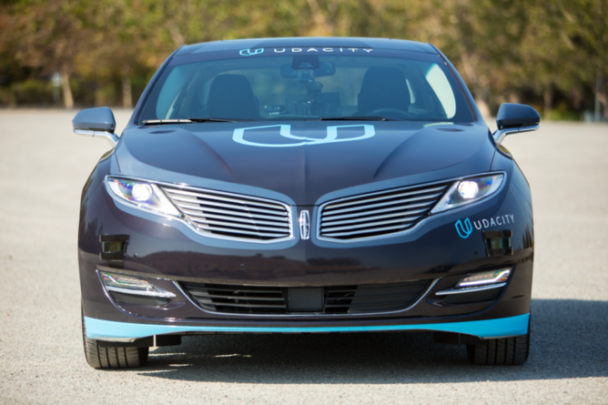
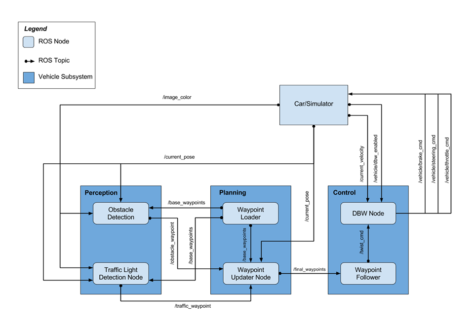
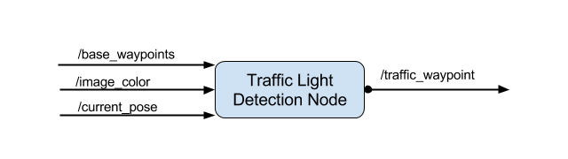
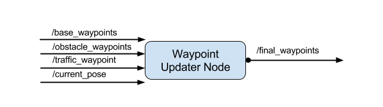
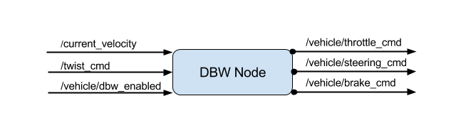

This is the project repo for the final project of the Udacity Self-Driving Car Nanodegree: Programming a Real Self-Driving Car by the team  **Drive Layer**. We built ROS nodes to implement core functionality of the autonomous vehicle system, including traffic light detection, control, and waypoint following.




### Team members 

* Ahmed Mahmoud  
  a.mostfa@gmail.com
* Ahmed Zaitoon  
  ahmed.zaitoon91@gmail.com
* Mohamed Alaa Eldin  
  mohammed.alaa92@gmail.com
     


### System architecture
The following is a system architecture diagram showing the ROS nodes and topics used in the project.  


*Note* : For this project, the obstacle detection node is not implemented.

### Perception subsystem 
This subsystem is responsible for perceiving the environment around the vehicle and and publishing observations to other subsystems such as determining the state of upcoming traffic lights and sending their status to other subsystems.

### Planning subsystem
This subsystem plans a trajectory for the vehicle to follow by publishing a fixed number of waypoints ahead of the vehicle with the correct target velocities depending on the vehicle's position along with the state of upcoming traffic lights.

### Control subsystem
This subsystem publishes the control commands for the vehicle in terms of steering , throttle and brake commands based on the list of waypoints.

**We have implemented the following nodes :**

#### 1. Traffic Light Detetction Node  
It's implemented in `tl_detector.py`. This node takes in data from the `/image_color, /current_pose`, and `/base_waypoints` topics and publishes the locations to stop for red traffic lights to the `/traffic_waypoint topic`.The `/current_pose` topic provides the vehicle's current position, and `/base_waypoints` provides a complete list of waypoints the car will be following.  



#### 2. Waypoint Updater Node
It's implemented in `waypoint_updater.py`. The purpose of this node is to update the target velocity property of each waypoint based on the vehicle's current position and traffic lights detection data. This node will subscribe to the `/base_waypoints`, `/current_pose`, `/obstacle_waypoint`, and `/traffic_waypoint` topics, and publish a list of waypoints ahead of the car with target velocities to the `/final_waypoints` topic.



#### 3. DBW node
 It's implemented in `dbw_node.py`.Carla is equipped with a drive-by-wire (dbw) system, meaning the throttle, brake, and steering have electronic control. This node subscribes to the `/current_velocity` topic along with the `/twist_cmd` topic to receive target linear and angular velocities. Additionally, It will subscribe to `/vehicle/dbw_enabled`, which indicates if the car is under drive-by-wire or driver control. This node will publish throttle, brake, and steering commands to the `/vehicle/throttle_cmd`, `/vehicle/brake_cmd`, and `/vehicle/steering_cmd` topics.`dbw_node.py` is set up to publish steering, throttle, and brake commands at 50hz. The DBW system on Carla expects messages at this frequency, and will disengage (reverting control back to the driver) if control messages are published at less than 10hz. This is a safety feature on the car intended to return control to the driver if the software system crashes.

 


Please use **one** of the two installation options, either native **or** docker installation as suggested by Udacity.

### Native Installation

* Be sure that your workstation is running Ubuntu 16.04 Xenial Xerus or Ubuntu 14.04 Trusty Tahir. [Ubuntu downloads can be found here](https://www.ubuntu.com/download/desktop).
* If using a Virtual Machine to install Ubuntu, use the following configuration as minimum:
  * 2 CPU
  * 2 GB system memory
  * 25 GB of free hard drive space

  The Udacity provided virtual machine has ROS and Dataspeed DBW already installed, so you can skip the next two steps if you are using this.

* Follow these instructions to install ROS
  * [ROS Kinetic](http://wiki.ros.org/kinetic/Installation/Ubuntu) if you have Ubuntu 16.04.
  * [ROS Indigo](http://wiki.ros.org/indigo/Installation/Ubuntu) if you have Ubuntu 14.04.
* [Dataspeed DBW](https://bitbucket.org/DataspeedInc/dbw_mkz_ros)
  * Use this option to install the SDK on a workstation that already has ROS installed: [One Line SDK Install (binary)](https://bitbucket.org/DataspeedInc/dbw_mkz_ros/src/81e63fcc335d7b64139d7482017d6a97b405e250/ROS_SETUP.md?fileviewer=file-view-default)
* Download the [Udacity Simulator](https://github.com/udacity/CarND-Capstone/releases).

### Docker Installation
[Install Docker](https://docs.docker.com/engine/installation/)

Build the docker container
```bash
docker build . -t capstone
```

Run the docker file
```bash
docker run -p 4567:4567 -v $PWD:/capstone -v /tmp/log:/root/.ros/ --rm -it capstone
```

### Port Forwarding
To set up port forwarding, please refer to the [instructions from term 2](https://classroom.udacity.com/nanodegrees/nd013/parts/40f38239-66b6-46ec-ae68-03afd8a601c8/modules/0949fca6-b379-42af-a919-ee50aa304e6a/lessons/f758c44c-5e40-4e01-93b5-1a82aa4e044f/concepts/16cf4a78-4fc7-49e1-8621-3450ca938b77)

### Usage

1. Clone the project repository

2. Install python dependencies
```bash
cd CarND-Capstone
pip install -r requirements.txt
```
3. Make and run styx
```bash
cd ros
catkin_make
source devel/setup.sh
roslaunch launch/styx.launch
```
4. Run the simulator

### Real world testing
1. Download [training bag](https://s3-us-west-1.amazonaws.com/udacity-selfdrivingcar/traffic_light_bag_file.zip) that was recorded on the Udacity self-driving car.
2. Unzip the file
```bash
unzip traffic_light_bag_file.zip
```
3. Play the bag file
```bash
rosbag play -l traffic_light_bag_file/traffic_light_training.bag
```
4. Launch your project in site mode
```bash
cd CarND-Capstone/ros
roslaunch launch/site.launch
```
5. Confirm that traffic light detection works on real life images
